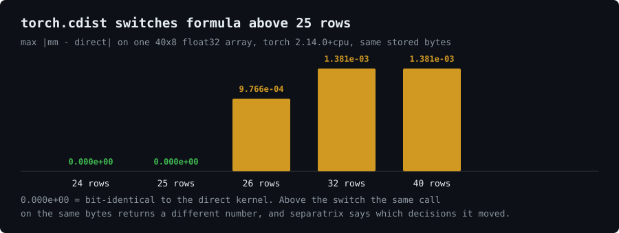
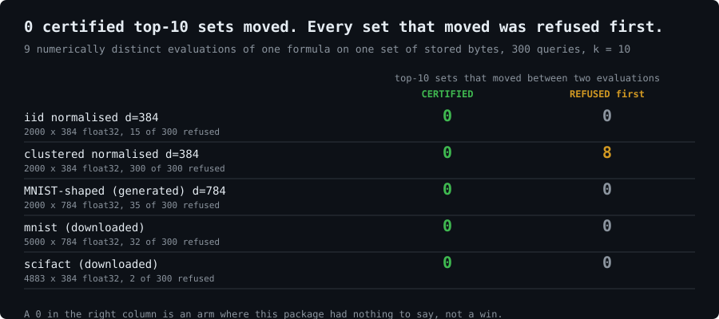
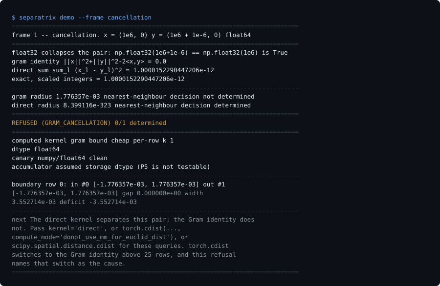

# separatrix

**Which of your top-k, argmin or threshold decisions were determined by your data, and which
were decided by the rounding of the kernel you happened to call — or a refusal that names the
boundary and the code change that would settle it.**



`torch.cdist` switches to the cancellation-prone Gram identity above 25 rows because it is
faster. Below the switch the two compute modes are bit-identical; above it, on the same
stored bytes, they are not. separatrix tells you which of your rankings that moved — before
you run it twice.

```
pip install separatrix        #  or:  uv pip install separatrix
```

```python
import separatrix

idx, v = separatrix.certified_topk(corpus, queries, k=10)

v.status        # CERTIFIED | CERTIFIED_UPCAST | NOT CERTIFIED | REFUSED
v.n_refused     # an exact integer, never a score and never a probability
v.frontiers     # for each undetermined row: the pair, both intervals, the gap, the deficit
v.next_action   # what to change. one refusal names a code change, the rest name a re-observation
```

It never raises for an arithmetic outcome and it has no `on_refuse` knob. A bare score array
is a `TypeError` at the call site — an enclosure is a function of the computation, not of its
result — and that is a statement about your code, not about your data, so it is an exception
and never a verdict.

---

## The mechanism is 25 years old, and saying so is what makes the rest believable

**CGAL's `Filtered_predicate` and `Interval_nt`** have shipped exactly this rule since ~2001:
evaluate in interval arithmetic, an interval disjoint from zero certifies the sign, an
overlap escalates to exact. **Melquiond and Pion** formally certified the static a-priori
filters, which are the same class of bound and are machine-checked where these are not. The
bound itself is one page of **Higham, *ASNA* chapter 3**. The only difference here is the
adversary: a rank-k *set* boundary in 384 dimensions in Python, against a geometric
predicate's sign in 2 or 3 dimensions in C++, where the escalation target is a set rather
than a sign.

Three more things a reader should know before the first claim, because two of them beat this
design on their own axis:

- **`torch.cdist(..., compute_mode="donot_use_mm_for_euclid_dist")`** is one keyword, already
  installed, and it *removes* the cancellation class rather than diagnosing it. The fix
  already exists and is cheap. Knowing which of your decisions needed it did not.
- **scikit-learn issue 9354 / PR 13554** fixed `euclidean_distances` float32 instability by
  chunked upcasting, **on by default since it landed**. That is the mitigation this certifies
  the need for, and it means the addressable population is smaller than the pitch:
  `torch.cdist` above 25 rows, hand-rolled Gram code, and low-precision or out-of-range
  indexes.
- **Ogita–Rump–Oishi `Dot2`** gives an a-posteriori bound orders of magnitude tighter than
  any a-priori `gamma_n`. Benchmarked here as an arm: it certifies **64 of 64** boundaries
  this package refuses, at **48× to 78×** the cost, because it is elementwise and forfeits
  the gemm. If you can afford 50×, use Dot2. [RESULTS §7.1](RESULTS.md#71-ogitarumpoishi-dot2-beats-this-on-coverage-decisively)
- **`torch.use_deterministic_algorithms`, `CUBLAS_WORKSPACE_CONFIG`, ReproBLAS** give
  same-machine run-to-run reproducibility and guarantee nothing across batch size, backend or
  device. They make two runs agree on a value that was never determined. separatrix leaves
  the kernel alone and reports whether the answer was ever in doubt.
- **CADNA and Discrete Stochastic Arithmetic** report unstable branching as a first-class
  counter — the same output shape — but by a 95 percent confidence estimate from three <!-- # sx: quote -->
  random-rounding runs. That is the evidence class this replaces with a proof over a box.
- **`python-flint` (Arb) and `mpmath.iv`** are both pip-installable and both rigorous, doing
  enclose-or-escalate today. Arb is scalar and would take minutes on a 300×5,000 score matrix
  that BLAS does in 17 ms. "The mechanism is unknown to the Python ecosystem" is not a
  sustainable claim and is not made.

---

## What CERTIFIED means, and what it does not

Let `X` and `Q` be the arrays **as stored in memory** and let `s` be the value of the named
score formula in **exact real arithmetic** on those stored numbers. separatrix returns an
index set `T` and radii `R ≥ 0` with `|D_i − s_i| ≤ R_i`, and says CERTIFIED only when

```
    max_{i ∈ T} (D_i + R_i)   <   min_{j ∉ T} (D_j − R_j)
```

Then `T` is the top-k set of `s`, and of every vector in the box. The corollary is the only
sentence worth quoting:

> **Any other evaluation of the same formula on the same stored bytes, whose own error is
> contained by its own certified box, returns the same `T`.** Batch size, BLAS backend,
> thread count, chunk size, reduction order, FMA use, and `torch.cdist`'s 25-row switch
> cannot change it. Determinism across backends is a theorem here, not a measurement over
> reruns.

### CERTIFIED says nothing about how the numbers got into the array

A 384-dimensional embedding out of a float16 forward pass carries ~1e-3 relative error,
three to four orders of magnitude above the float32 rounding being certified. **CERTIFIED
means *rounding did not choose this ranking*.** It says nothing about the model, the
quantiser or the sensor. This is a heading and not a footnote because it is the way the
certificate will be misread.

A refusal is not a finding. It means no certificate was formed; only `escalate=True` decides
which way the boundary actually falls, and on the corpora measured here it decided that
**379 of 384 refusals were pessimism rather than damage**.

---

## The headline



Of 1,500 top-10 decisions across five corpora, **1,116 were certified and 0 of them moved**
between nine numerically distinct evaluations of one formula on one set of stored bytes —
numpy gram float32, the same with the reduction permuted, numpy direct, numpy float64,
`scipy.cdist`, `sklearn.euclidean_distances`, `torch.cdist` on both compute modes, and
`torch.cdist` at batch 32. Every set that did move had been refused first.

**Four of the five corpora returned 0 disagreements among the refused rows too.** Those four
are arms where this package had nothing to say, and they are printed at the same size as the
one that did. [RESULTS §2](RESULTS.md#2-the-headline)

---

## What it is not

Measured, on this machine, and each of these withdrew a claim the design was carrying:

- **Not faster than float64.** Rung 1 costs **1.66×** the float64 Gram control and **1.00×**
  the float32-vs-float64 diff it replaces, on a 5,000×784 float32 corpus with 300 queries.
  The brief's *0.14×* and the design's revised *0.91×* both fail to reproduce.
  [RESULTS §6](RESULTS.md#6-cost)
- **Not a general retrieval top-k certifier.** On the synthetic clustered generator it
  refuses **300 of 300**. On real BEIR SciFact with all-MiniLM-L6-v2 it refuses **2 of 300**,
  and both of those were pessimism. The design predicted the first number and generalised it
  to real embeddings; the real corpus says otherwise, in both directions.
  [RESULTS §4](RESULTS.md#4-the-pessimism-gate-and-how-it-landed)
- **Not better on coverage than a four-line tuned margin.** `gap > eps·|score|` certifies 295
  of 300 where separatrix certifies 0. What it does not have is any `eps` below 1e-3 that
  avoids issuing certificates a witness contradicts — and the `eps` that does costs 122 of
  300 certificates elsewhere. The differentiator is **no tuning, and a proof**, which is
  smaller than the pitch. [RESULTS §7.2](RESULTS.md#72-the-tuned-margin-baseline-draws-on-four-of-five-corpora)
- **Not a detection.** The float32-vs-float64 diff was right on 1,495 of 1,500 rankings
  measured here, and found the same 5 rows separatrix's escalation did.

It is a **diagnostic and a build gate** whose most defensible output is a refusal that names
the Gram-identity kernel switch as the cause.

---

## The demo, three frames, no download

```
separatrix demo --frame cancellation     # two points 1e-6 apart at magnitude 1e6
separatrix demo --frame batch            # two evaluations, two answers, one set of bytes
separatrix demo --frame preview          # which boundaries were never separable, named first
separatrix probe                         # this machine's u, canary, gamma table, torch flags
```



At float32 the two points **are** the same stored vector — `np.float32(1e6 + 1e-6) ==
np.float32(1e6)` is `True` — so `0.0` is the correct answer for the data as it stands. The
frame runs in float64, where the inputs are distinct and the Gram identity *still* returns
exactly `0.0`, and `scipy` returns `1e-6`.

> **Changing the formula is the fix. Changing the precision is not. This is the thing that
> tells you which of your decisions needed the change.**

Frame 3 is the only one no existing tool can do: every cheap alternative — a float64 diff,
two batch sizes, stochastic rounding — is *a-posteriori*. It finds what moved, needs two
runs, and cannot tell you a boundary was undetermined when both runs happened to agree.

---

## The CLI and the build gate

```
separatrix check --corpus corpus.npy --queries queries.npy --k 10 \
                 [--kernel gram|direct] [--bound cheap|tight] [--per-pair] \
                 [--escalate] [--upcast] [--ordered] [--max-refused 0.05] [--json]
```

Exit **0** certified, **1** not certified (an exact tie, which no arithmetic removes),
**2** refused, **3** a usage error, **4** certified-upcast. `CERTIFIED_UPCAST` is never 0,
because a CI job must not read a pass for a computation its production index does not run.

```python
with separatrix.gate(max_refused=0.05, fixture="scifact-d384-fp32"):
    run_your_evaluation()          # every certified_topk call reports into the open gate
```

`max_refused` is required — no default. The fraction is keyed to a config digest over the
nine fields that change what a refused fraction *means*; on a digest mismatch the gate
**refuses to compare** rather than failing, because a gate that goes red on a CPU or numpy
swap is deleted in a week. It reads `.separatrix-gate.json` and never writes it: a gate that
records its own budget is vacuous.

---

## The refusal catalogue

Every entry carries a typed code, a named object, and a next action.

| code | exit | what it names |
|---|---|---|
| `BOUNDARY_UNDETERMINED` | 2 | the frontier pair, both intervals, `gap`, `width`, `deficit` |
| `GRAM_CANCELLATION` | 2 | **the only one that names a code change**: the direct kernel separates this pair, the Gram identity does not, and `torch.cdist` switched above 25 rows |
| `EXACT_TIE` | 1 | escalation proved the two scores equal. The only refusal no precision removes |
| `RANGE_UNSAFE` | 2 | `‖x‖²+‖q‖²+2‖x‖‖q‖` overflows the working dtype, per row, checked before any score is read |
| `NONFINITE_INPUT` | 2 | the row and column. separatrix will not impute |
| `BOUND_VACUOUS` | 2 | `(d+2)·u > 1/2`. A stated domain limit, not a property of your data |
| `REDUCED_PRECISION_ARITHMETIC` | 2 | the 4×4 canary caught arithmetic coarser than the declared `u` — TF32, bfloat16 inputs, AMX — with no vendor flag taxonomy |
| `ESCALATION_BUDGET` | 2 | the frontier exceeded `max_escalations` |

Usage errors are exceptions, exit class 3, and are deliberately **not** in this catalogue.

---

## Install, run, reproduce

```
python -m venv .venv
.venv/Scripts/pip install -e .              # numpy and scipy are the only hard dependencies
.venv/Scripts/python -m pytest tests/ -q    # 195 passed
.venv/Scripts/python bench.py --out results.json --assets assets
```

`torch`, `scikit-learn`, `datasets` and `sentence-transformers` are optional, imported
lazily, and named in `bench.py`'s own output when absent rather than skipped silently. Every
module owns a runnable self-check: `python -m separatrix.enclose`.

**[RESULTS.md](RESULTS.md)** carries every measured number, the command that produced it, the
control it was scored against, every arm that lost, and a NOT EARNED section for the claims
nothing here measured — GPU numbers, approximate indexes, accumulator width, machine-checked
bounds, and any probability at all.

MIT. Numbers measured on CPython 3.11.9, numpy 2.4.6, scipy 1.17.1, torch 2.14.0+cpu,
WIN-16QAL06O9GB.
